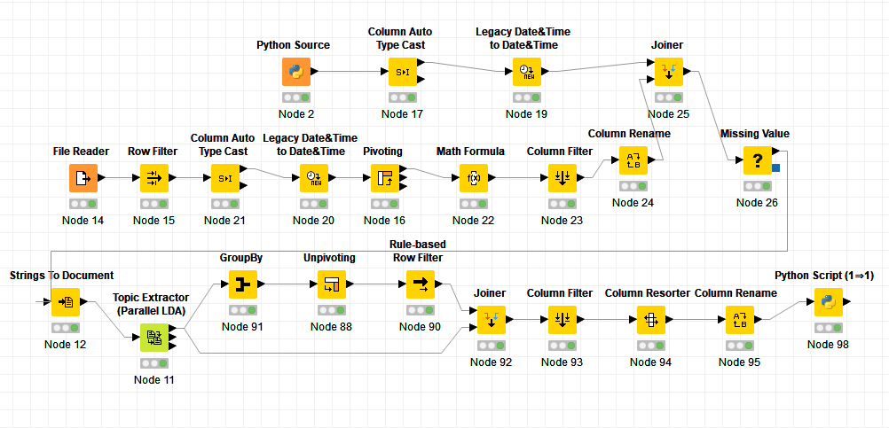

# Project

## CS 410, Text Information Retrieval

### University of Illinois at Urbana-Champaign, Fall 2020

#### Ramin Melikov, Chris Zhu, Francis Alloba

##### Due: 12/13/2020, 11:59 PM CST

# Reproduction of Mining Causal Topics in Text Data

Kim, H. D., Castellanos, M., Hsu, M., Zhai, C. X., Rietz, T., & Diermeier, D. (2013). Mining causal topics in text data: Iterative topic modeling with time series feedback. In CIKM 2013 - Proceedings of the 22nd ACM International Conference on Information and Knowledge Management (pp. 885-890). (International Conference on Information and Knowledge Management, Proceedings). https://doi.org/10.1145/2505515.2505612

# Video Introduction to the Project

https://www.youtube.com/watch?v=2RAoMGm07t8

**Please watch the video overview of the project first.**

# Repository Location

https://github.com/czhu99/CourseProject

### This is a KNIME Project

KNIME is an Advanced Analytics Platform. It is available for free at http://www.KNIME.com

**After the KNIME is downloaded and installed, you have to import the workflow to see how it works. The workflow in in the repository. Workflow is named `paper_replication.knwf`.**



# Some code from our project

*The code below is used in KNIME to get the articles that are tagged with `Bush` or `Gore` and it then does some processing that produces a table with 2 columns: a date column and a string column. In the string column each row represents each article. Each string is lowercased, lematized, filtered, etc. See code for exact steps.*

````python
from pandas import DataFrame
import os
from bs4 import BeautifulSoup
import metapy
import pandas as pd

base_dir = 'D:/git/text_information_systems/project_files/project/nyt_corpus/data/2000'

def extract_data(filename):
    return BeautifulSoup(open(filename, encoding = 'utf8'))

def list_files(dir):
    return [os.path.join(r, n) for r, _, f in os.walk(dir) for n in f]

blobs = []
for file_path in list_files(base_dir):
    blobs.append(extract_data(file_path))

filtered = [
    blob 
    for blob in blobs 
    if [
        person.get_text() 
        for person in blob.find_all('person') 
        if person.get_text() in ['Bush, George W (Gov)', 'Gore, Al (Vice Pres)']
    ]
]

tokenized = {}
date = []
articles = []

for article in filtered:
    doc = metapy.index.Document()
    year = article.find('meta', attrs = {'name':"publication_year"}).get("content")
    month = article.find('meta', attrs = {'name':"publication_month"}).get("content")
    day = article.find('meta', attrs = {'name':"publication_day_of_month"}).get("content")
    doc.content(article.body.get_text())
    tok = metapy.analyzers.ICUTokenizer(suppress_tags=True)
    tok = metapy.analyzers.LowercaseFilter(tok)
    tok = metapy.analyzers.ListFilter(tok, "D:/git/text_information_systems/project_files/project/nyt_corpus/data/lemur-stopwords.txt", metapy.analyzers.ListFilter.Type.Reject)
    tok = metapy.analyzers.Porter2Filter(tok)
    tok = metapy.analyzers.LengthFilter(tok, min=2, max=30)
    tok.set_content(doc.content())
    articles.append(" ".join([token for token in tok if not any(c.isdigit() or c == '.' for c in token)]))
    date.append(str(year) + '-' + str(month) + '-' + str(day))

tokenized['date'] = date
tokenized['articles'] = articles

output_table = pd.DataFrame.from_dict(tokenized)
````

*The following code gets the `p-value` for the Granger Causality test*

````python
from statsmodels.tsa.stattools import grangercausalitytests
import pandas as pd

gr = grangercausalitytests(input_table[['price', 'topic_sum']], 1, verbose = False)

p = gr[1][0]['ssr_ftest'][1]

dict = {'p': p}

output_table = pd.DataFrame(dict, index = [0])
````

# Team Contributions

For our collaboration process during this project, we did pair programming with all three members present on a video call. Ramin did the majority of the coding on his machine while Chris and Francis viewed the screen and gave input and ideas.
